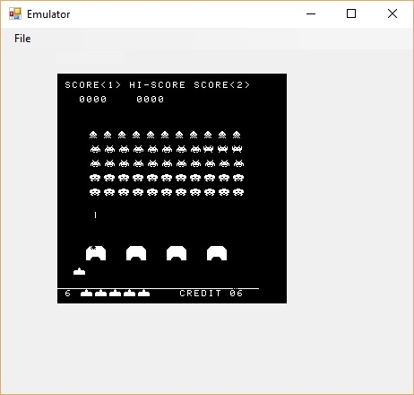

# 8080 Emulator
Basic 8080 Emulator written in `C#` rendering to a `WinForm`. 
 
This emulator will play the original Space Invaders game, albeit at break neck speed !
 
Check the data folder, as it includes a test file to get you started 😁.

Keys :- 
 
C- coin
 
1 - One player
 
2 - Two player
 
Left arrow - Move left
 
Right arrow - Move right
 
Space - Fire
 
 
I wrote this "fun" 😧 ! .... well it seemed like a good idea at the start of the project anyway.
